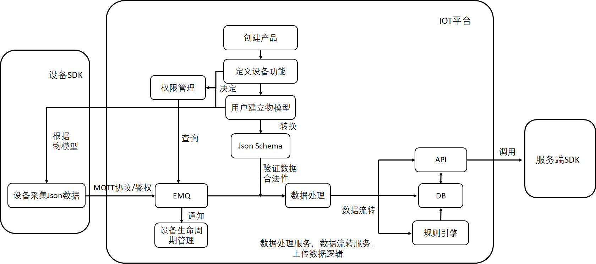
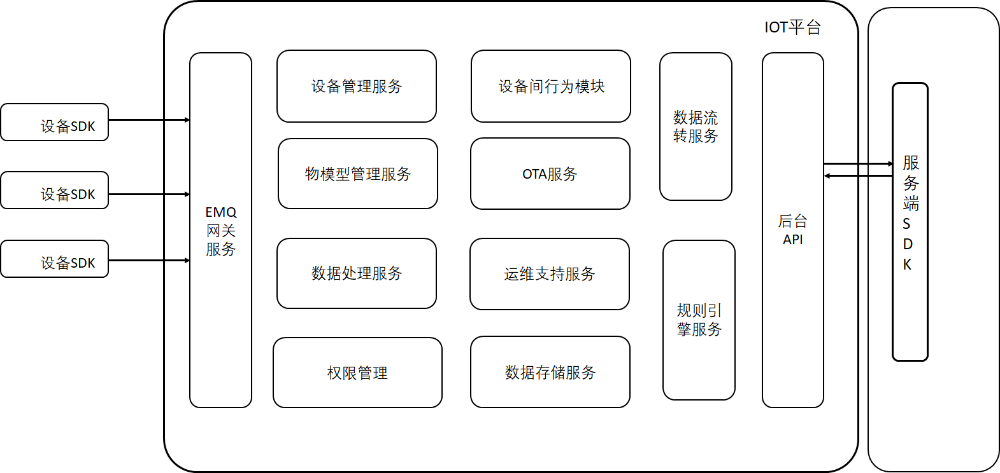

#  Iot_demo

---
这是一个完成度很低的IOT平台，时间有限，由于平台复杂度过高，大部分时间都在做技术选型，仅仅完成了一个半服务。

## 应用逻辑

以下为数据上传部分的逻辑，指令下传同理，在此不赘述。

1. 首先，在物模型管理服务中，用户在平台需要添加产品信息，设备信息。
使用物模型对设备的属性和可能的行为进行建模，系统会返回，产品key，产品secret。
将key，secret还有填写的name烧录入系统中，即可完成线上准备。

2. 在返回key，secret的同时，权限管理服务会将这两项写入Redis，并将物模型中，需要使用的Topic也写入redis中。以便MQTT服务器验证客户端身份。

3. 在设备与平台通讯时，设备首先会尝试与EMQ服务器建立连接，提交信息验证的三元组验证身份。

4. 完成身份验证后，会在设备生命周期管理服务进行设备在线的注册。告知其他设备该设备上线。

5. 再根据定义的物模型想IOT平台发送数据。数据首先会来到数据处理服务中。
若数据为普通的Json数据，服务会调用之前由物模型生成的Json Schema对数据进行合法性校验。
若数据为二进制数据，服务会将二进制数据转化成Json数据后再进行校验。（数据透传）

6. 之后，数据会来到规则引擎服务。在这里数据会被分发到各个服务中。
    1. 设备间行为服务。该服务定义设备间的行为，并且将设备间行为辑转化为可以与设备交互的指令。
        - 例如，若定义了“天黑开灯”这一行为。该服务会在规则引擎中插入一规则，当光照传感器接受到的光线小于一定值时，数据会被转到设备间行为服务中。该服务会根据收到的数据向智能灯发送一条“开灯”的指令。
    2. 数据流转服务。该服务主要完成与服务端的数据交互。可以通过MQTT协议，HTTP协议，SOAP协议将符合规则的数据上传到服务端中。
    3. 数据存储服务。所有设备上传的数据会在MongoDB的NoSQL进行备份。其他例如物模型数据，设备定义数据使用MySQL进行存储。

---

## 模块分类

|模块|描述|完成度|
|:--:|--|:---:|
|设备管理服务 |提供设备动态注册，静态注册，上下线的支持。开放接口，让其他服务科通过该服务查询设备权限，设备状态|完成|
|物模型管理服务|创建产品，添加产品信息，添加设备，定义设备属性，创建物模型|部分完成|
|数据处理服务|通过物模型生成Json Schema，进行数据校验。将二进制数据转换为Json数据，完成数据透传|未完成|
|权限管理服务|通过Redis+EMQ完成设备和服务端SDK对于Topic权限的控制,查询权限，修改权限，删除权限|未完成|
|设备间行为服务|定义设备间的行为，并且在名族一定条件后完成对设备行为的触发|未完成|
|OTA服务|自动在线升级服务|未完成|
|运维支持服务|监控，日志，远程管理|未完成|
|数据存储服务|将数据存入MongoDB，用作数据分析和备份|未完成|
|数据流转服务|提供接口供服务端SDK进行数据访问|未完成|
|规则引擎服务|使用规则引擎，编写SQL对Topic中的数据进行处理，并配置转发规则将处理后的数据转发到其他服务，非常方便的对设备的数据进行保存和分析|未完成|

设备生命周期管理

## MQTT TOPIC API

|API|Description|JSON|
|:--:|:--:|:---:|
|/registerdevice |设备注册|<pre></pre>|

//TODO 暂时只使用了这一个API

MQTT TOPIC 主要用于设备与IOT平台交互。

## RESTful API

//TODO 暂时还没有完成的

RESTful API主要用于服务端SDK，或Web 与IoT后台进行交互

## 参考文献

### IOT平台架构

物联网iot与微服务平台交互架构
https://www.processon.com/special/template/5bebfb46e4b027a022a48754

物联网的一种参考架构
https://www.infoq.cn/article/internet-of-things-reference-architecture

物联网平台概览 - Amazon, Microsoft, IBM IoT 解决方案概述 (完整版)
https://blog.51cto.com/hiweb/1923993

IOT Technical Guide <- IOT 技术指南 -> the era of the Internet of Everything
https://github.com/sanshengshui/IOT-Technical-Guide

通过 IoT 架构简化 IoT 解决方案的开发
https://www.ibm.com/developerworks/cn/iot/library/iot-lp201-iot-architectures/index.html

IOT---(4)物联网平台架构设计
https://blog.csdn.net/zhangbijun1230/article/details/79556718

对早期开发无影响，以上大致了解即可，但是对于项目成长帮助很大。参考他人的架构实现，更好的将应用分层，确定服务边界，实现微服务。

### 产品文档

阿里云物联网平台
https://help.aliyun.com/document_detail/125800.htm

百度天工
https://cloud.baidu.com/doc/IoTSolution/s/qjwvywujk/
https://cloud.baidu.com/doc/IOT/s/bjwvy6so0/

AWS IoT
https://docs.aws.amazon.com/zh_cn/iot/latest/developerguide/what-is-aws-iot.html

Azure IoT Hub（这玩意是英文的，量力而行
https://docs.microsoft.com/en-us/azure/iot-dps/

这几个产品文档要仔细看！ 
可以根据他们的文档去猜他们具体的实现。
读懂之后会发现，其实每家提供的东西都差不多，整个IOT平台也就那么几个模块。

### 开源项目

1.1K Star
https://github.com/kaaproject/kaa

国人的项目，没做完，不过架构图画的不错。
https://github.com/pnoker/iot-dc3

9个顶级开发IoT项目的开源物联网平台
https://blog.csdn.net/shnbiot/article/details/80432017

### 技术细节

#### 物模型
我是庖丁,<肢解IOT平台>之物模型
https://cloud.tencent.com/developer/article/1450922

#### MQTT

EMQ X R3.2 消息服务器简介
https://docs.emqx.io/broker/v3/cn/getstarted.html

Eclipse Mosquitto
https://mosquitto.org/

MQTT 入门介绍(这个比较简单… 不想看长文可以看这个)
https://www.runoob.com/w3cnote/mqtt-intro.html

MQTT协议中文版（非常全面的MQTT协议介绍，就是长
https://github.com/mcxiaoke/mqtt

MQTT协议JAVA实现（官网，英文
https://www.eclipse.org/paho/

MQTT Java客户端的使用
https://www.jianshu.com/p/65e1748a930c

Paho的话，照着别人的demo做一下，再自己看一下源码和英文文档就差不多了。

#### Json Schema

Understanding JSON Schema（其实这一篇就够了，不过是英文的）
https://json-schema.org/understanding-json-schema/index.html

如果有仔细对比过阿里与物模型与Json Schema。会发现二者其实是非常相近的。因此，可以考虑使用Json Schema 来实现对于设备上传数据的数据校验。

### 写在最后
既然要做这玩意，大量的文档阅读是跑不了的。文档不光是中文的，英文也有涉及。IoT环境下，很多情境和Web区别非常大。就网络协议来说，web以HTTP为主，而IoT平台可能使用：REST，gRPC，SOAP,MQTT等等非常多的通讯标准。很多东西在日常的Web开发中接触的并不多。
而且别人提供的仅仅只是文档，架构图也仅仅只有模块的名称和功能，市面上也没有很成熟的一键式解决方案。模块与模块之间是如何相互调用，设备与平台之间的数据是如何交互的，所有东西都要通过别人的文档，零星的文章，还有开源项目一点一点拼凑出来。因此项目难度还是有些大的~
不过嘛，机遇与挑战并存~ 能力就是在这种大难度的项目中锻炼出来的，加油！